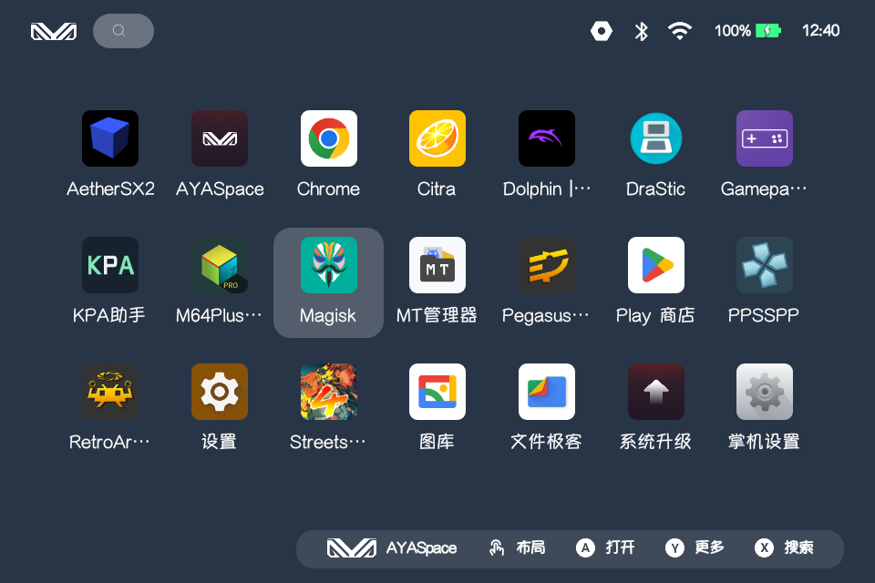
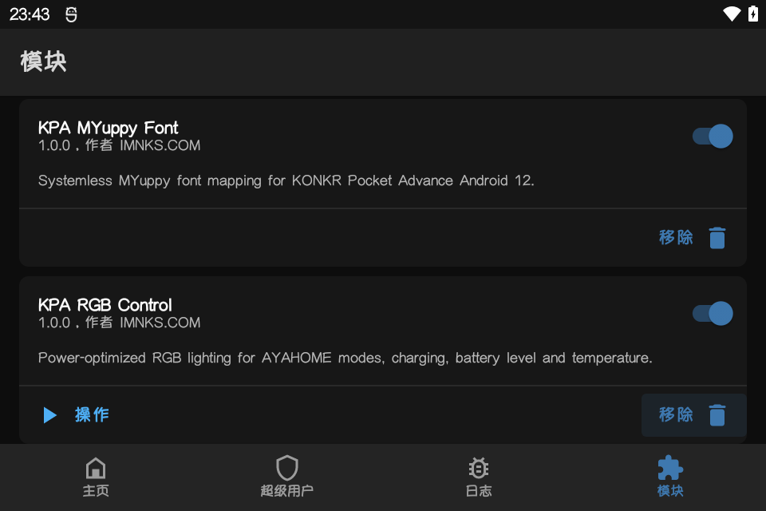

# KPA Modules

[English](README.en.md) | [简体中文](README.md)

Independent Magisk modules for KONKR Pocket Advance (`GT78-VN`, Android 12).





## Modules

### KPA MYuppy Font

- Module ID: `kpa_myuppy_font`
- Maps the system sans-serif family to MYuppy fonts.
- Installation checks common font overlays in other modules and stops with the conflicting module ID. Disable the conflicting module, reinstall and reboot. Script-driven font mounts may not be detected.
- Provides two weights: 100–500 map to Regular and 600–900 to Bold; no separate italic face.
- Uses existing Roboto paths for MYuppy Chinese and Latin glyphs; stock Noto CJK files remain unchanged.
- Apps where PIF or similar tools hide modules fall back to stock fonts. On firmware 0828, the Google sign-in page opened with Play Integrity Fork v18 and Shamiko enabled. This does not establish an integrity verdict.
- Uses a systemless Magisk overlay and does not modify the system partition.
- Disable or uninstall the module and reboot to restore the stock font.

### KPA RGB Control

- Module ID: `kpa_rgb_control`

Controls the chassis RGB light from AYAHOME performance presets:

| State | Effect |
|---|---|
| Power Save | Emerald slow breathing |
| Balanced | Smooth rainbow cycle |
| Game | Electric-blue slow breathing |
| Full Power | Magenta fast pulse |
| CPU ≥85°C or battery ≥50°C | Orange fast breathing |
| CPU ≥90°C or battery ≥55°C | Red fast blink |
| Charging, full, or battery ≤15% | Stock battery LED controlled by Android |
| Screen off/locked | Off unless Android is showing a battery indication; resumes after wake |

Screen-on priority: dangerous temperature > temperature warning > Android battery LED > performance mode. The module only reads temperatures; it never reads or modifies fan settings.

The controller uses a native ARM64 daemon. Peak brightness is `64/255`, with lower per-state levels for clear but comfortable indicators. Animation updates run every 0.2 seconds, performance mode is checked every 2 seconds, CPU/battery temperature every 10 seconds, and battery state every 5 seconds. Unchanged colors are not written again. While charging, full, or low on battery, the module stops writing the LED and Android supplies the stock battery indication. No wake lock is held, and Android freezes the process during deep sleep.

Configuration: `/data/adb/kpa_rgb_control.conf`

Status and log:

- `/data/adb/kpa_rgb_control.state`
- `/data/adb/kpa_rgb_control.log`

When charging, full, or low battery begins, the module restores the corresponding stock color once to resolve the race with a performance effect, then stops writing the LED. Only effect transitions and essential errors are logged. Repeated LED write failures are limited to one entry per minute. Above 16 KB, the log is trimmed to approximately the newest 8 KB; an update installation clears the previous log.

### Performance and power

Measured on the 8-core MT6785V device with about 3.8 GiB RAM using the 1.0.0 build:

- Screen on: about `0.3%` of one CPU core, or about `0.04%` of total 8-core capacity.
- Screen off while ADB keeps the device awake: about `0.53%` of one core, or about `0.07%` total.
- Resident memory: about `4.46 MB`, or about `0.12%` of system RAM.
- No wake lock is held, so real deep-sleep overhead is lower than the screen-off ADB test.

This is near-zero background overhead, not literal `0%`. The device exposes no separate current telemetry for the RGB LEDs, so exact LED power cannot be measured. Screen-off shutdown, bounded brightness and infrequent sensor sampling minimize that load.

### KPA Touch Guard

- Module ID: `kpa_touch_guard`
- Hold MODE for 2 seconds to toggle touch; each hold triggers only once.
- Touch is enabled after every reboot. Controller mappings and the original MODE behavior remain unchanged.
- Locking or turning off the screen restores touch. Unlocking restores the previous disabled preference without interrupting an active touch gesture.
- The Magisk Action button restores touch and stops monitoring. Reboot to resume monitoring.
- Startup and toggling tested on `BW03_20260828`. Not bundled with KPA-Root.

Keys use event-driven monitoring without wake locks. There is no polling while touch is enabled; a retained disabled preference checks the lock state every 2 seconds. Failed checks restore touch. Pressing the power button restores touch immediately; other lock methods have a detection delay. Only the touchscreen is grabbed; exiting releases it automatically. The module directory contains `state` and a `startup.log` overwritten on each startup. Touch coordinates are not logged.

Restore touch from an authorized computer:

```sh
adb shell su -c 'sh /data/adb/modules/kpa_touch_guard/action.sh'
```

## Installation

1. Download the required ZIP from [Releases](https://github.com/tbc0309/KPA-Modules/releases).
2. Select “Install from storage” in Magisk.
3. Reboot after installation.

A reboot is also recommended after enabling, disabling or removing a module.

## Release layout

- Font releases use `font-v*` tags.
- RGB releases use `rgb-v*` tags.
- Touch Guard releases use `touch-v*` tags.
- Each module is built and released independently.

See [THIRD_PARTY_NOTICES.md](THIRD_PARTY_NOTICES.md) for MYuppy font attribution.

Copyright © 2026 IMNKS.COM.

[IMNKS.COM](https://imnks.com/) · [GitHub](https://github.com/tbc0309)
